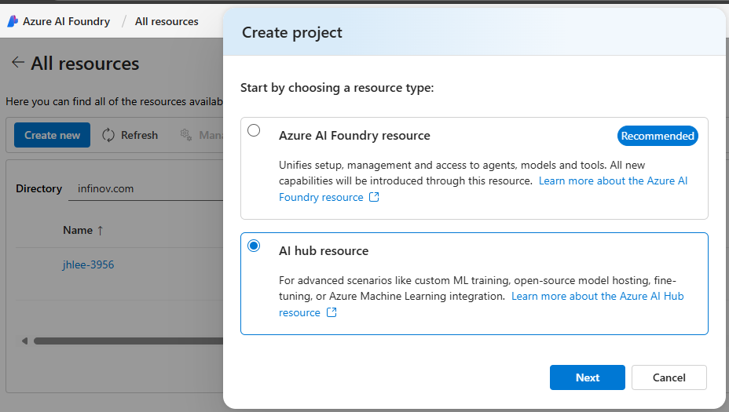
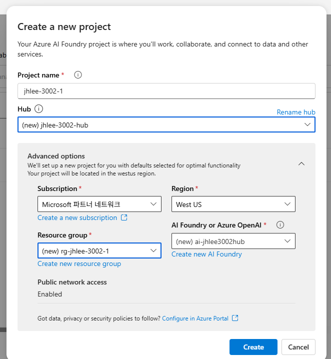
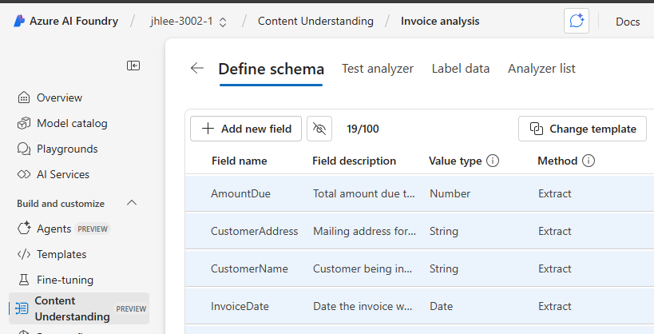
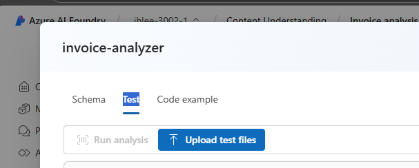

다음은 `Extract information from multimodal content` 실습 가이드에 대한 상세한 번역 및 해설 문서입니다. 주요 용어와 메뉴는 영어 원문을 그대로 사용하여 실제 Azure 환경과 일치하도록 했으며, 각 단계의 의미와 배경 기술에 대한 친절한 설명을 추가했습니다.

---

# 실습 가이드: 멀티모달 콘텐츠에서 정보 추출하기

이 실습에서는 **Azure AI Content Understanding**을 사용하여 문서, 이미지, 오디오 녹음, 비디오 등 다양한 유형의 콘텐츠에서 유용한 정보를 추출하는 방법을 배웁니다.

이 실습을 완료하는 데 약 **40분**이 소요됩니다.

### **[실습의 의미와 배경]**

오늘날 우리는 텍스트 문서뿐만 아니라 이미지, 음성, 영상 등 다양한 형태의 데이터, 즉 **멀티모달(multimodal) 콘텐츠**에 둘러싸여 있습니다. 이러한 비정형 데이터 속에는 비즈니스에 중요한 정보들이 숨어있지만, 수동으로 분석하고 추출하는 것은 매우 비효율적입니다.

**Azure AI Content Understanding**은 바로 이 문제를 해결하기 위한 강력한 AI 서비스입니다. 이 서비스를 사용하면 복잡한 코딩이나 머신러닝 전문 지식 없이도, 우리가 원하는 정보가 무엇인지만 정의(Schema 정의)하면 AI가 자동으로 해당 콘텐츠를 분석하고 구조화된 데이터로 추출해주는 맞춤형 분석기(Analyzer)를 만들 수 있습니다.

이 실습을 통해 송장(PDF), 발표 슬라이드(이미지), 음성 메시지(오디오), 화상 회의(비디오)라는 4가지의 각기 다른 시나리오를 경험하며 Azure AI가 어떻게 멀티모달 콘텐츠를 이해하고 비즈니스 가치를 창출하는지 직접 확인하게 될 것입니다.

## Azure AI Foundry 허브 및 프로젝트 생성하기

이 실습에서 사용할 Azure AI Foundry의 기능들은 **Azure AI Foundry hub** 리소스를 기반으로 하는 **project**가 필요합니다.

> **[용어 설명]**
> *   **Azure AI Foundry hub**: 여러 AI 프로젝트를 중앙에서 관리하고 리소스(데이터, 컴퓨팅, 모델 등)를 공유하기 위한 최상위 작업 공간입니다. 협업과 거버넌스를 위한 중심점 역할을 합니다.
> *   **Project**: 특정 AI 작업을 위한 개별 컨테이너입니다. 이 실습에서는 '콘텐츠 정보 추출'이라는 특정 작업을 위해 하나의 프로젝트를 생성합니다.

1.  웹 브라우저에서 [Azure AI Foundry 포털](https://ai.azure.com) (`https://ai.azure.com`)을 열고 Azure 자격 증명으로 로그인합니다. 처음 로그인할 때 나타나는 팁이나 빠른 시작 창은 닫고, 필요한 경우 왼쪽 상단의 **Azure AI Foundry** 로고를 클릭하여 홈 페이지로 이동합니다.
   
   

3.  브라우저에서 `https://ai.azure.com/rResources`로 이동하여 **Create new**를 선택한 다음, **AI hub resource**를 생성하는 옵션을 선택합니다.
   

5.  **Create a project** 마법사에서 프로젝트에 유효한 이름을 입력하고, 새 허브를 생성하는 옵션을 선택합니다. 그런 다음 **Rename hub** 링크를 사용하여 새 허브의 이름을 지정하고, **Advanced options**를 확장하여 다음 설정을 지정합니다.
    *   **Subscription**: 사용자의 Azure 구독
    *   **Resource group**: 기존 리소스 그룹을 선택하거나 새로 생성
    *   **Region**: 다음 위치 중 하나를 선택합니다. (*이 문서를 작성하는 시점에서 Azure AI Content Understanding은 아래 지역에서만 사용 가능합니다.*):
        *   Australia East
        *   Sweden Central
        *   West US
          

    > **참고**: 리소스 이름에 제한을 두는 정책이 있는 Azure 구독을 사용하는 경우, **Create a new project** 대화 상자 하단의 링크를 통해 Azure 포털에서 허브를 직접 생성해야 할 수 있습니다.
    >
    > **팁**: **Create** 버튼이 비활성화되어 있다면, 허브 이름을 고유한 영숫자 값으로 변경해보세요.

6.  프로젝트가 생성될 때까지 기다립니다.

## 콘텐츠 다운로드하기

분석할 콘텐츠는 .zip 압축 파일에 포함되어 있습니다. 이 파일을 다운로드하여 로컬 폴더에 압축을 풉니다.

1.  새 브라우저 탭에서 [`content.zip`](https://github.com/microsoftlearning/mslearn-ai-information-extraction/raw/main/Labfiles/content/content.zip) 파일을 다운로드하여 로컬 폴더에 저장합니다.
2.  다운로드한 *content.zip* 파일의 압축을 풀고 포함된 파일들을 확인합니다. 이 파일들은 실습에서 다양한 Content Understanding 분석기를 만드는 데 사용될 것입니다.

## 1. 송장 문서에서 정보 추출하기

첫 번째로, 송장(Invoice)에서 특정 정보를 추출할 수 있는 Azure AI Content Understanding 분석기를 만들어 보겠습니다. 먼저 샘플 송장을 기반으로 어떤 정보를 추출할지 정의하는 **스키마(Schema)**를 정의하는 것부터 시작합니다.

### 송장 분석을 위한 스키마 정의하기

> **[실습의 의미]**
> '스키마 정의'는 AI에게 무엇을 찾아야 할지 알려주는 '청사진'을 만드는 과정입니다. 우리는 샘플 송장(`invoice-1234.pdf`)을 AI에게 보여주고, "이런 문서에서는 '공급업체 이름', '총액', '품목 리스트' 같은 정보들을 찾아줘"라고 가르치는 것과 같습니다. **Invoice data extraction** 템플릿을 사용하면 일반적인 송장 필드들이 미리 정의되어 있어 작업을 더 쉽게 시작할 수 있습니다.

1.  Azure AI Foundry 프로젝트 홈 페이지가 열려있는 브라우저 탭에서 왼쪽 탐색 창의 **Content Understanding**을 선택합니다.
2.  **Content Understanding** 페이지 상단에서 **Custom task** 탭을 선택합니다.
3.  Content Understanding custom task 페이지에서 **+ Create**를 선택하고 다음 설정으로 작업을 생성합니다.
    *   **Task name**: `Invoice analysis`
    *   **Description**: `Extract data from an invoice`
    *   **Standard mode**: 선택됨
    *   **Advanced settings**:
        *   **Azure AI services connection**: Azure AI Foundry hub에 있는 Azure AI Services 리소스
        *   **Azure Blob Storage account**: Azure AI Foundry hub의 기본 스토리지 계정
4.  작업이 생성될 때까지 기다립니다. (만약 스토리지 접근 오류가 발생하면, 잠시 기다렸다가 다시 시도하세요. 새 허브의 권한 전파에는 몇 분이 걸릴 수 있습니다.)
5.  **Define schema** 페이지에서 압축을 푼 폴더의 **invoice-1234.pdf** 파일을 업로드합니다.

   
   
7.  파일 업로드 후, **Invoice data extraction** 템플릿을 선택하고 **Create**를 클릭합니다.
8.  제안된 필드 목록에서 이 송장 형식에 필요 없는 **BillingAddress**를 선택하고, 나타나는 **Delete field** (휴지통 아이콘)을 클릭하여 삭제합니다.
9.  마찬가지로, 다음의 불필요한 필드들도 삭제합니다:
    *   BillingAddressRecipient, CustomerAddressRecipient, CustomerId, CustomerTaxId, DueDate, InvoiceTotal, PaymentTerm, PreviousUnpaidBalance, PurchaseOrder, RemittanceAddress, RemittanceAddressRecipient, ServiceAddress, ServiceAddressRecipient, ShippingAddress, ShippingAddressRecipient, TotalDiscount, VendorAddressRecipient, VendorTaxId, TaxDetails
10.  **+ Add new field** 버튼을 사용하여 다음 필드들을 추가하고, 각 필드를 추가할 때마다 **Save changes** (체크 아이콘)를 클릭합니다:

| Field name | Field description | Value type | Method |
| :--- | :--- | :--- | :--- |
| `VendorPhone` | `Vendor telephone number` | String | Extract |
| `ShippingFee` | `Fee for shipping` | Number | Extract |

10. **Items** 필드 행을 보면, 이 필드가 **table** 타입(송장 내의 품목 목록)인 것을 확인할 수 있습니다. **Edit** (편집 아이콘)을 클릭하여 하위 필드 편집 페이지로 이동합니다.
11. **Items** 테이블 [오른쪽 테이블 아이콘 클릭!]에서 다음 하위 필드들을 제거합니다:
    *   Date, ProductCode, Unit, TaxAmount, TaxRate
12. **OK** 버튼을 눌러 변경 사항을 확정하고 상위 스키마로 돌아옵니다.
13. 완성된 스키마가 아래 이미지와 같은지 확인하고 **Save**를 클릭합니다.

    
    
15. **Test Analyzer** 페이지에서 분석이 자동으로 시작되지 않으면 **Run analysis**를 클릭하고 분석이 완료될 때까지 기다립니다.
16. 분석 결과를 검토합니다. **Fields** 창에서 식별된 각 필드의 상세 내용을 확인할 수 있습니다.

     

### 송장용 분석기(Analyzer) 빌드 및 테스트하기

> **[실습의 의미]**
> 스키마를 정의한 후에는 '분석기(Analyzer)'를 빌드해야 합니다. 분석기는 정의된 스키마를 바탕으로 실제 정보 추출 작업을 수행하는 AI 모델입니다. 빌드가 완료된 분석기는 이제 다른 비슷한 형식의 송장에도 재사용할 수 있습니다. 새로운 송장(`invoice-1235.pdf`)으로 테스트하는 것은 우리가 만든 분석기가 처음 본 문서도 잘 처리하는지 검증하는 중요한 과정입니다.

1.  **Analyzer list** 페이지를 선택한 다음, **+ Build analyzer**를 클릭하여 다음 속성으로 새 분석기를 빌드합니다.
    *   **Name**: `invoice-analyzer`
    *   **Description**: `Invoice analyzer`
2.  새 분석기가 준비될 때까지 기다립니다 (**Refresh** 버튼으로 상태 확인).
3.  분석기가 빌드되면 **invoice-analyzer** 링크를 클릭합니다.
4.  **invoice-analyzer** 페이지에서 **Test** 탭을 선택합니다.

   

6.  **+ Upload test files** 버튼을 사용하여 **invoice-1235.pdf** 파일을 업로드하고, **Run analysis**를 클릭하여 송장에서 필드 데이터를 추출합니다.
7.  **Fields** 창을 검토하여 분석기가 테스트 송장에서 올바른 필드를 추출했는지 확인합니다.
8.  **Results** 창을 검토하여 분석기가 클라이언트 애플리케이션에 반환할 JSON 응답을 확인합니다.
9.  **Code example** 탭에서 Content Understanding REST API를 사용하여 이 분석기를 호출하는 클라이언트 애플리케이션 개발에 사용할 수 있는 샘플 코드를 확인합니다.
10.  **invoice-analyzer** 페이지를 닫습니다.

## 2. 슬라이드 이미지에서 정보 추출하기

이번에는 차트가 포함된 발표 슬라이드 이미지에서 정보를 추출하는 분석기를 만들어 보겠습니다.

### 이미지 분석을 위한 스키마 정의하기

> **[실습의 의미]**
> 이전 송장 실습과의 가장 큰 차이점은 **Method**가 `Extract`가 아닌 `Generate`라는 점입니다.
> *   **Extract**: 문서에 있는 텍스트를 그대로 가져옵니다.
> *   **Generate**: AI(내부적으로는 GPT와 같은 대규모 언어 모델)가 이미지의 내용(텍스트와 차트 포함)을 '이해'하고, 이를 바탕으로 새로운 텍스트(예: 요약, 차트의 수)를 '생성'합니다.
>
> 이 실습은 단순 텍스트 추출을 넘어, 시각적 데이터를 해석하고 요약하는 더 높은 수준의 AI 능력을 보여줍니다.

1.  Azure AI Foundry 프로젝트 홈 페이지의 왼쪽 탐색 창에서 **Content Understanding**을 선택합니다.
2.  **Custom task** 탭에서 **+ Create**를 선택하고 다음 설정으로 작업을 생성합니다.
    *   **Task name**: `Slide analysis`
    *   **Description**: `Extract data from an image of a slide`
    *   (나머지 설정은 이전과 동일하게 유지)
3.  작업이 생성되면 **Define schema** 페이지에서 **slide-1.jpg** 파일을 업로드하고, **Image analysis** 템플릿을 선택한 후 **Create**를 클릭합니다.
4.  **+ Add new field** 버튼을 사용하여 다음 필드들을 추가합니다 (각 필드 추가 후 저장):

| Field name | Field description | Value type | Method |
| :--- | :--- | :--- | :--- |
| `Title` | `Slide title` | String | Generate |
| `Summary` | `Summary of the slide` | String | Generate |
| `Charts` | `Number of charts on the slide` | Integer | Generate |

5.  **Table** 타입의 `QuarterlyRevenue` 필드를 추가하고, 하위 필드 편집 페이지에서 다음 필드들을 추가합니다:

| Field name | Field description | Value type | Method |
| :--- | :--- | :--- | :--- |
| `Quarter` | `Which quarter?` | String | Generate |
| `Revenue` | `Revenue for the quarter` | Number | Generate |

6.  상위 스키마로 돌아와 **Table** 타입의 `ProductCategories` 필드를 추가하고, 하위 필드 편집 페이지에서 다음 필드들을 추가합니다:

| Field name | Field description | Value type | Method |
| :--- | :--- | :--- | :--- |
| `ProductCategory` | `Product category name` | String | Generate |
| `RevenuePercentage` | `Percentage of revenue` | Number | Generate |

7.  완성된 스키마를 확인하고 **Save**를 클릭한 후,

   

   **Test Analyzer** 페이지에서 **Run analysis**를 실행합니다.

   
   
10.  분석 결과를 검토합니다. **Fields** 창에서 **QuarterlyRevenue**와 **ProductCategories**를 확장하여 AI가 차트 데이터를 어떻게 구조화된 테이블로 변환했는지 확인합니다.

### 분석기 빌드 및 테스트하기

> **[실습의 의미]**
> 이제 슬라이드 이미지용 분석기를 빌드하고, 다른 슬라이드(`slide-2.jpg`)로 테스트합니다. 이 테스트를 통해 AI가 다른 구조의 차트도 이해하고, 없는 정보(제품 카테고리 차트)는 추출하지 않는다는 점을 확인할 수 있습니다. 이는 AI가 단순히 패턴을 외우는 것이 아니라, 주어진 콘텐츠를 기반으로 유연하게 분석한다는 것을 보여줍니다.

1.  **Analyzer list** 페이지에서 **+ Build analyzer**를 클릭하여 새 분석기를 빌드합니다.
    *   **Name**: `slide-analyzer`
    *   **Description**: `Slide image analyzer`
2.  분석기 빌드가 완료되면, **Test** 탭으로 이동하여 **slide-2.jpg** 파일을 업로드하고 **Run analysis**를 실행합니다.
3.  **Fields** 창에서 추출된 결과를 확인합니다. 두 번째 슬라이드에는 제품 카테고리 관련 정보가 없으므로 해당 필드는 비어있는 것이 정상입니다.
4.  **Results**와 **Code example** 탭을 검토한 후, **slide-analyzer** 페이지를 닫습니다.

## 3. 음성사서함 오디오 녹음에서 정보 추출하기

이번에는 음성 메시지 오디오 파일에서 정보를 추출하는 분석기를 만들어 보겠습니다.

### 오디오 분석을 위한 스키마 정의하기

> **[실습의 의미]**
> 오디오 파일 분석은 두 단계의 AI 파이프라인으로 이루어집니다.
> 1.  **음성-텍스트 변환(Speech-to-Text)**: 먼저 Azure AI Speech 서비스가 오디오 파일을 텍스트로 변환(Transcription)합니다.
> 2.  **텍스트 분석(Text Analysis)**: 그 후, 변환된 텍스트를 기반으로 `Generate` 메소드를 사용하여 스키마에 정의된 정보(발신자, 요약, 회신 번호 등)를 추출합니다.
>
> 이 과정은 음성 데이터를 분석하여 실행 가능한 정보로 변환하는 강력한 비즈니스 시나리오를 보여줍니다.

1.  **Content Understanding**의 **Custom task** 탭에서 **+ Create**를 클릭하여 새 작업을 생성합니다.
    *   **Task name**: `Voicemail analysis`
    *   **Description**: `Extract data from a voicemail recording`
2.  **Define schema** 페이지에서 **call-1.mp3** 파일을 업로드하고, **Speech transcript analysis** 템플릿을 선택한 후 **Create**를 클릭합니다.
3.  오른쪽 **Content** 창에서 **Get transcription preview**를 클릭하여 AI가 변환한 텍스트를 미리 볼 수 있습니다.
4.  **+ Add new field** 버튼을 사용하여 다음 필드들을 추가합니다:

| Field name | Field description | Value type | Method |
| :--- | :--- | :--- | :--- |
| `Caller` | `Person who left the message` | String | Generate |
| `Summary` | `Summary of the message` | String | Generate |
| `Actions` | `Requested actions` | String | Generate |
| `CallbackNumber` | `Telephone number to return the call` | String | Generate |
| `AlternativeContacts` | `Alternative contact details` | List of Strings | Generate |

5.  스키마를 **Save**하고 **Test Analyzer** 페이지에서 **Run analysis**를 실행합니다. 오디오 분석은 시간이 다소 걸릴 수 있습니다.
6.  분석 결과를 검토합니다. **Fields** 창에서 **AlternativeContacts** 필드를 확장하여 여러 개의 연락처 정보가 리스트 형태로 잘 추출되었는지 확인합니다.

### 분석기 빌드 및 테스트하기

1.  **Analyzer list** 페이지에서 **+ Build analyzer**를 클릭하여 새 분석기를 빌드합니다.
    *   **Name**: `voicemail-analyzer`
    *   **Description**: `Voicemail audio analyzer`
2.  분석기 빌드가 완료되면, **Test** 탭에서 **call-2.mp3** 파일을 업로드하고 분석을 실행합니다.
3.  추출된 결과를 확인하고, **Results**와 **Code example** 탭을 검토한 후 페이지를 닫습니다.

## 4. 화상 회의 녹화 영상에서 정보 추출하기

마지막으로, 화상 회의 녹화 영상에서 정보를 추출하는 분석기를 만들어 보겠습니다.

### 비디오 분석을 위한 스키마 정의하기

> **[실습의 의미]**
> 비디오 분석은 이 실습의 가장 복합적인 멀티모달 시나리오입니다. 비디오는 오디오(음성)와 비주얼(화면, 발표 자료) 정보를 모두 포함하고 있기 때문입니다. AI는 비디오의 오디오 트랙을 텍스트로 변환하고, 그 내용을 분석하여 회의 요약, 참석자, 논의된 슬라이드, 할 일(Action Item) 등을 자동으로 정리해 줍니다. 이는 회의록 작성을 자동화하는 등 매우 실용적인 활용 사례입니다.

1.  **Content Understanding**의 **Custom task** 탭에서 **+ Create**를 클릭하여 새 작업을 생성합니다.
    *   **Task name**: `Conference call video analysis`
    *   **Description**: `Extract data from a video conference recording`
2.  **Define schema** 페이지에서 **meeting-1.mp4** 파일을 업로드하고, **Video analysis** 템플릿을 선택한 후 **Create**를 클릭합니다.
3.  **Get transcription preview**를 통해 비디오의 음성 대본을 확인할 수 있습니다.
4.  **+ Add new field** 버튼을 사용하여 다음 필드들을 추가합니다:

| Field name | Field description | Value type | Method |
| :--- | :--- | :--- | :--- |
| `Summary` | `Summary of the discussion` | String | Generate |
| `Participants` | `Count of meeting participants` | Integer | Generate |
| `ParticipantNames` | `Names of meeting participants` | List of Strings | Generate |
| `SharedSlides` | `Descriptions of any PowerPoint slides presented` | List of Strings | Generate |
| `AssignedActions` | `Tasks assigned to participants` | Table | Generate |

5.  **AssignedActions** 필드(Table 타입)의 하위 필드로 다음을 추가합니다:

| Field name | Field description | Value type | Method |
| :--- | :--- | :--- | :--- |
| `Task` | `Description of the task` | String | Generate |
| `AssignedTo` | `Who the task is assigned to` | String | Generate |

6.  스키마를 **Save**하고 **Test Analyzer** 페이지에서 **Run analysis**를 실행합니다. 비디오 분석은 시간이 더 오래 걸릴 수 있습니다.
7.  분석이 완료되면, **Fields** 창에서 요약, 참석자, 할 일 목록 등이 구조화된 데이터로 잘 추출되었는지 확인합니다.

### 분석기 빌드 및 테스트하기

1.  **Analyzer list** 페이지에서 **+ Build analyzer**를 클릭하여 새 분석기를 빌드합니다.
    *   **Name**: `conference-call-analyzer`
    *   **Description**: `Conference call video analyzer`
2.  분석기 빌드가 완료되면, **Test** 탭에서 **meeting-2.mp4** 파일을 업로드하고 분석을 실행합니다.
3.  두 번째 회의 영상에서도 정보가 잘 추출되는지 확인한 후, 페이지를 닫습니다.

## 정리 (Clean up)

실습을 마친 후 불필요한 Azure 비용이 발생하지 않도록 생성한 리소스를 삭제하는 것이 중요합니다.

1.  Azure AI Foundry 포털에서 허브로 이동하여, overview 페이지에서 생성한 프로젝트를 선택하고 삭제합니다.
2.  Azure 포털에서 이 실습을 위해 생성했던 리소스 그룹을 삭제합니다.
